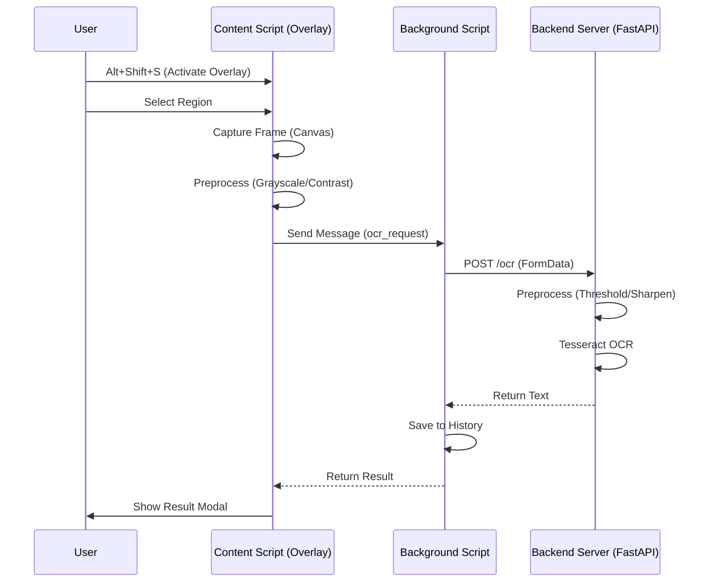

# ⚡ Fast Video OCR - Extract Text from Video Frames

Speed-optimized Chrome extension + Python backend for extracting text from video frames using Tesseract OCR.

---

## 📋 Features

- ✅ Extract text from any HTML5 video (YouTube, Twitch, Zoom, local files)
- ✅ Client-side preprocessing (grayscale + contrast) for 66% smaller uploads
- ✅ Fast Tesseract OCR (40-80ms processing time)
- ✅ **New:** History of captured texts
- ✅ **New:** Draggable result modal with "Retry High Accuracy"
- ✅ Auto-copy to clipboard
- ✅ Keyboard shortcuts (Alt+Shift+S to activate)
- ✅ Works with SD/720p and HD video
- ✅ Privacy-focused (no data storage, no analytics)

---

## 🧜‍♀️ Workflow



---

## 📁 Project Structure & Functions

### `extension/` (Chrome Extension)

| File | Description | Key Functions |
|------|-------------|---------------|
| `manifest.json` | Extension configuration | Defines permissions, content scripts, background worker. |
| `content.js` | Main content script | `activateOverlay()`: Injects UI.<br>`captureFrame()`: Captures video frame to canvas.<br>`sendToBackend()`: Sends Blob to background. |
| `background.js` | Service worker | `handleOCRRequest()`: Sends image to backend API.<br>`updatePopup()`: Saves result to history.<br>`copyToClipboard()`: Manages clipboard. |
| `overlay.js` | Overlay UI logic | `VideoOCROverlay`: Class for selection box logic.<br>`onMouseDown/Move/Up`: Handles drag selection. |
| `result_modal.js` | Result UI | `ResultModal`: Class for the draggable result popup.<br>`show()`: Displays text and buttons. |
| `popup.html` | Extension popup UI | HTML structure for tabs (Latest, History, Settings). |
| `popup.js` | Popup logic | `loadHistory()`: Fetches history from storage.<br>`switchTab()`: Handles tab navigation. |

### `backend/` (Python/FastAPI)

| File | Description | Key Functions |
|------|-------------|---------------|
| `main.py` | FastAPI application | `POST /ocr`: Fast OCR endpoint.<br>`POST /ocr/accurate`: High-accuracy endpoint.<br>`GET /health`: Health check. |
| `preprocessor.py` | Image processing | `preprocess_image_fast()`: Otsu/Simple thresholding.<br>`preprocess_image_quality()`: Denoising + Adaptive threshold. |
| `ocr_engine.py` | Tesseract wrapper | `extract_text_fast()`: LSTM-only OCR (OEM 1).<br>`extract_text_accurate()`: Legacy+LSTM OCR (OEM 3). |

---

## 🚀 Quick Start

### Prerequisites

- Python 3.10+ with pip
- Tesseract OCR 5.x
- Chrome/Chromium browser

### 1. Install Tesseract OCR

**Ubuntu/Debian:**
```bash
sudo apt-get update
sudo apt-get install tesseract-ocr tesseract-ocr-eng libtesseract-dev
```

**macOS:**
```bash
brew install tesseract
```

**Windows:**
Download installer from https://github.com/UB-Mannheim/tesseract/wiki

### 2. Setup Backend

```bash
cd backend

# Create virtual environment
python3 -m venv venv
source venv/bin/activate  # On Windows: venv\Scripts\activate

# Install dependencies
pip install -r requirements.txt

# Run server
uvicorn main:app --host 0.0.0.0 --port 8000 --reload
```

Backend will start at `http://localhost:8000`

### 3. Load Chrome Extension

1. Open Chrome and go to `chrome://extensions/`
2. Enable "Developer mode" (toggle in top right)
3. Click "Load unpacked"
4. Select the `extension` folder
5. Extension should appear in your toolbar

### 4. Test It Out

1. Open any YouTube video
2. Press `Alt+Shift+S` to activate overlay
3. Click and drag to select text region
4. Release to capture and extract text
5. Text is shown in a modal and saved to history

---

## 🔧 Configuration

### Backend API URL

The extension defaults to `http://localhost:8000`. To change:

1. Click extension icon to open popup
2. Scroll to "Settings" tab
3. Update "Backend API URL"
4. Connection status will update automatically

---

## 🎹 Keyboard Shortcuts

- `Alt+Shift+S` - Activate overlay (start selection)
- `Alt+Shift+D` - Deactivate overlay (stop selection)
- `Esc` - Cancel selection

---

## 🐳 Docker Deployment

```bash
cd backend

# Build image
docker build -t video-ocr-backend .

# Run container
docker run -p 8000:8000 video-ocr-backend
```

Access at `http://localhost:8000`

---

## 🔒 Privacy & Security

- ✅ No data storage (all processing in-memory)
- ✅ No analytics or tracking
- ✅ No external API calls
- ✅ Runs locally on your machine
- ✅ Images deleted immediately after processing

---

## 📄 License

MIT License - see LICENSE file for details
